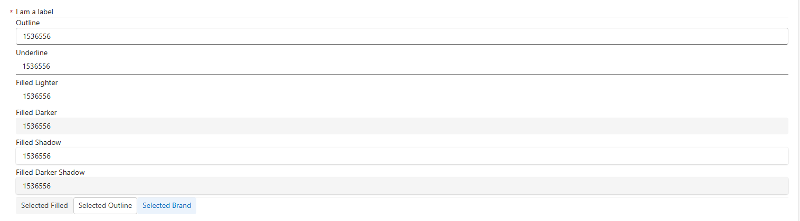

# PCF Controls with Fluent UI

Model-Driven apps use the Fluent design system. To align the design of PCF
components with Power Apps we can use the Fluent UI React Component Library.

<https://react.fluentui.dev/?path=/docs/concepts-introduction--docs>

## Accessing Fluent Theme From Context

This is straight-forward and well described in the following article:

<https://dianabirkelbach.wordpress.com/2024/01/13/standard-or-custom-theming-for-pcf-using-fluent-ui-v9>

```ts
const contextTheme = context.fluentDesignLanguage;

const props: IComponentThemeSamplerControlProps = {
    fluentDesignState: contextTheme,
    value: this._value,
    onChange: this.handleInputChange.bind(this),
};
return React.createElement(ComponentThemeSamplerControl, props);
```

In the above code block, we access the fluentDesignState from context and pass
this as a prop to the root React component. This can be received by the
component:

```ts
export interface IComponentThemeSamplerControlProps {
    fluentDesignState?: {
        tokenTheme: Theme;
    };
    value?: string;
    onChange: (
        ev: React.ChangeEvent<HTMLInputElement>,
        data: InputOnChangeData
    ) => void;
}

export const ComponentThemeSamplerControl: React.FC<
    IComponentThemeSamplerControlProps
> = ({ value, onChange, fluentDesignState }) => {
    // ...
};
```

To make this theme accessible to Fluent UI React Components in the control, we
need to wrap the control in a FluentProvider and pass the theme as a prop:

```ts
<FluentProvider theme={fluentDesignState?.tokenTheme}>
    <Label>Filled Darker</Label>
    <Input
        value={value}
        onChange={onChange}
        appearance="filled-darker"
        style={inputStyle}
    />
</FluentProvider>
```

## Examples


